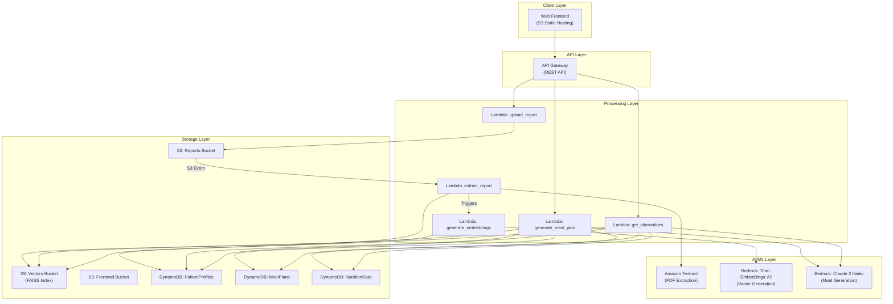
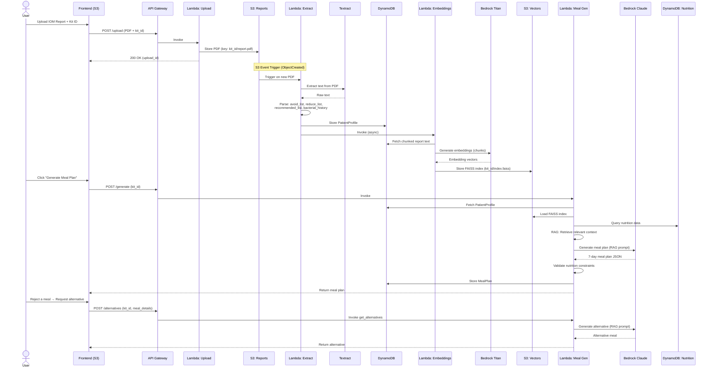
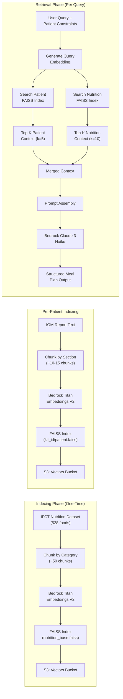
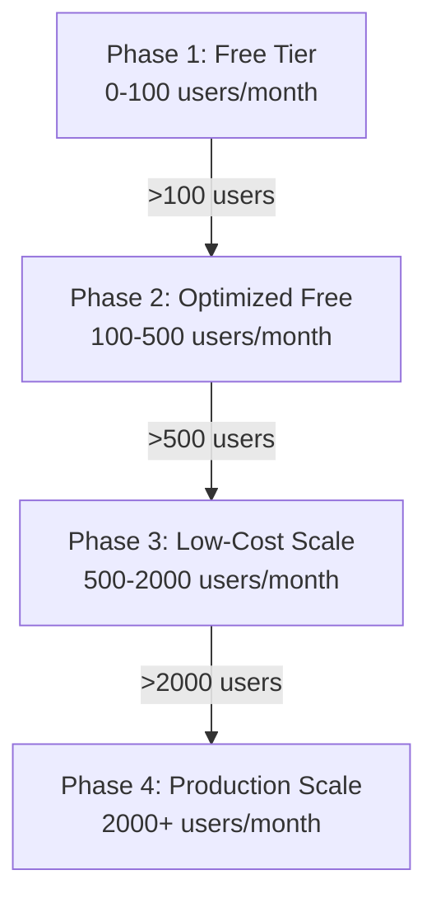

# Personalized Meal Plan Generator — Complete System Design

A serverless, RAG-powered Indian Meal Plan Generator built entirely on **AWS Free Tier**. Processes IOM patient reports, extracts dietary constraints, and generates personalized 7-day Indian household meal plans with nutritional validation.

---

## Table of Contents

1. [System Architecture](#1-system-architecture)
2. [Data Flow Diagram](#2-data-flow-diagram)
3. [AWS Services Mapping](#3-aws-services-mapping)
4. [Database Schema Design](#4-database-schema-design)
5. [RAG Pipeline Design](#5-rag-pipeline-design)
6. [Prompt Engineering Strategy](#6-prompt-engineering-strategy)
7. [Scalability Plan](#7-scalability-plan)
8. [Free Tier Cost Optimization](#8-free-tier-cost-optimization)

---

## 1. System Architecture

### High-Level Overview



### Component Breakdown

| Component | Technology | Role |
|-----------|-----------|------|
| **Frontend** | HTML/CSS/JS on S3 | UI for report upload, meal display, alternatives |
| **API Gateway** | REST API | Routes requests to Lambda functions |
| **Upload Service** | Lambda (Python 3.12) | Handles PDF upload to S3 |
| **Extraction Service** | Lambda (Python 3.12) | Textract OCR → structured data extraction |
| **Embedding Service** | Lambda (Python 3.12) | Generates FAISS vectors from report + nutrition data |
| **Meal Generator** | Lambda (Python 3.12) | RAG retrieval + Bedrock LLM meal plan generation |
| **Alternatives Service** | Lambda (Python 3.12) | Replacement meal generation on rejection |
| **Vector Store** | FAISS on S3 | Stores per-patient + nutrition embeddings |
| **Patient DB** | DynamoDB | Stores extracted patient profiles |
| **Meal DB** | DynamoDB | Stores generated meal plans |
| **Nutrition DB** | DynamoDB | IFCT nutrition dataset |

### Design Principles

1. **Fully Serverless** — Zero infrastructure to manage; pay only for what you use
2. **Event-Driven** — S3 events trigger extraction pipeline automatically
3. **Stateless Lambdas** — Each Lambda reads from/writes to external stores
4. **RAG-First** — Every LLM call is grounded in retrieved nutrition/patient data
5. **Fail-Safe Validation** — Post-generation nutrition validation catches hallucinations

---

## 2. Data Flow Diagram

### End-to-End User Journey



### Data Transformation Pipeline

```
IOM PDF Report
    │
    ▼ (Textract)
Raw Text
    │
    ▼ (Regex + NLP Parsing)
Structured Data:
    ├── avoid_list: ["gluten", "dairy", ...]
    ├── reduce_list: ["sugar", "sodium", ...]
    ├── recommended_list: ["fiber-rich", "probiotics", ...]
    ├── bacterial_history: [{bacteria, count, status}, ...]
    └── raw_chunks: ["chunk1", "chunk2", ...]
    │
    ▼ (Titan Embeddings)
Vector Index (FAISS)
    ├── patient_vectors: 768-dim embeddings of report chunks
    └── nutrition_vectors: 768-dim embeddings of IFCT foods
    │
    ▼ (RAG Retrieval + Claude 3 Haiku)
7-Day Meal Plan (JSON):
    ├── day_1:
    │   ├── breakfast: {meal, ingredients, calories, macros}
    │   ├── mid_morning_snack: {...}
    │   ├── lunch: {...}
    │   ├── evening_snack: {...}
    │   └── dinner: {...}
    ├── day_2: ...
    └── ...day_7
```

---

## 3. AWS Services Mapping

### Services Used & Free Tier Limits

| AWS Service | Purpose | Free Tier Allowance |
|-------------|---------|---------------------|
| **S3** | Report storage, FAISS index, frontend hosting | 5 GB storage, 20K GET, 2K PUT/month |
| **Lambda** | All compute (5 functions) | 1M requests, 400K GB-seconds/month |
| **API Gateway** | REST API for frontend | 1M API calls/month (12 months) |
| **DynamoDB** | Patient profiles, meal plans, nutrition data | 25 GB storage, 25 RCU, 25 WCU |
| **Textract** | PDF text extraction | 1,000 pages/month (3 months) |
| **Bedrock** | LLM (Claude 3 Haiku) + Embeddings (Titan V2) | Pay-per-token (see cost section) |
| **CloudWatch** | Logging & monitoring | 5 GB logs, 10 custom metrics |
| **IAM** | Access control | Always free |

### Resource Naming Convention

```
meal-plan-{resource}-{account-id-last4}
```

| Resource | Full Name |
|----------|-----------|
| S3 (Reports) | `meal-plan-reports-XXXX` |
| S3 (Vectors) | `meal-plan-vectors-XXXX` |
| S3 (Frontend) | `meal-plan-frontend-XXXX` |
| DynamoDB (Profiles) | `PatientProfiles` |
| DynamoDB (Plans) | `MealPlans` |
| DynamoDB (Nutrition) | `NutritionData` |
| API Gateway | `MealPlanAPI` |
| Lambda Functions | `meal-plan-{function-name}` |

### IAM Policy Map

```json
{
  "MealPlanLambdaRole": {
    "S3": ["GetObject", "PutObject", "ListBucket"],
    "DynamoDB": ["GetItem", "PutItem", "Query", "Scan", "UpdateItem"],
    "Textract": ["DetectDocumentText", "AnalyzeDocument"],
    "Bedrock": ["InvokeModel"],
    "CloudWatch": ["CreateLogGroup", "CreateLogStream", "PutLogEvents"],
    "Lambda": ["InvokeFunction"]
  }
}
```

---

## 4. Database Schema Design

### Table 1: `PatientProfiles`

**Purpose**: Store extracted patient data from IOM reports.

| Attribute | Type | Key | Description |
|-----------|------|-----|-------------|
| `kit_id` | `S` | **PK** | Unique patient kit identifier |
| `created_at` | `S` | — | ISO 8601 timestamp |
| `updated_at` | `S` | — | Last modification timestamp |
| `report_s3_key` | `S` | — | S3 path to original PDF |
| `extraction_status` | `S` | — | `PENDING` / `PROCESSING` / `COMPLETED` / `FAILED` |
| `avoid_list` | `L` | — | List of foods/substances to completely avoid |
| `reduce_list` | `L` | — | List of foods/substances to reduce intake |
| `recommended_list` | `L` | — | List of recommended foods/nutrients |
| `bacterial_history` | `L` | — | List of maps: `{name, count, status, notes}` |
| `allergies` | `L` | — | Extracted allergy information |
| `medical_conditions` | `L` | — | Relevant conditions (IBS, GERD, etc.) |
| `dietary_preferences` | `M` | — | `{vegetarian, vegan, jain, region}` |
| `calorie_target` | `N` | — | Daily calorie target (kcal) |
| `vector_index_key` | `S` | — | S3 path to FAISS index |

**Example Item:**
```json
{
  "kit_id": "KIT-2024-00142",
  "created_at": "2026-02-21T10:00:00Z",
  "extraction_status": "COMPLETED",
  "avoid_list": ["gluten", "lactose", "shellfish", "peanuts"],
  "reduce_list": ["refined sugar", "sodium", "saturated fat"],
  "recommended_list": ["high-fiber foods", "probiotics", "omega-3", "turmeric"],
  "bacterial_history": [
    {"name": "H. pylori", "count": "1.2e4", "status": "elevated", "notes": "Gastric inflammation"},
    {"name": "Lactobacillus", "count": "3.1e6", "status": "low", "notes": "Supplement recommended"}
  ],
  "dietary_preferences": {
    "vegetarian": true,
    "region": "South Indian"
  },
  "calorie_target": 1800
}
```

---

### Table 2: `MealPlans`

**Purpose**: Store generated meal plans with version history.

| Attribute | Type | Key | Description |
|-----------|------|-----|-------------|
| `kit_id` | `S` | **PK** | Patient kit ID |
| `plan_id` | `S` | **SK** | `PLAN#{timestamp}` — sortable version key |
| `created_at` | `S` | — | Generation timestamp |
| `plan_type` | `S` | — | `WEEKLY` / `DAILY` |
| `status` | `S` | — | `ACTIVE` / `SUPERSEDED` / `REJECTED` |
| `meals` | `M` | — | Full 7-day plan (nested map) |
| `nutrition_summary` | `M` | — | Daily averages: calories, protein, carbs, fat, fiber |
| `validation_result` | `M` | — | `{passed, violations[], score}` |
| `rejected_meals` | `L` | — | List of rejected meal IDs for feedback loop |
| `ttl` | `N` | — | TTL for auto-cleanup (epoch seconds) |

**GSI: `StatusIndex`** — `PK: kit_id`, `SK: status` — Query active plans quickly.

**Meal Object Structure:**
```json
{
  "day_1": {
    "breakfast": {
      "meal_id": "D1-BF-001",
      "name": "Ragi Dosa with Coconut Chutney",
      "ingredients": [
        {"name": "Ragi flour", "quantity_g": 80, "calories": 262},
        {"name": "Coconut (fresh)", "quantity_g": 30, "calories": 104},
        {"name": "Green chili", "quantity_g": 5, "calories": 2}
      ],
      "total_calories": 368,
      "macros": {"protein_g": 8.2, "carbs_g": 58, "fat_g": 12, "fiber_g": 6.4},
      "prep_time_min": 20,
      "tags": ["gluten-free", "high-fiber", "South Indian"],
      "avoids_validated": true
    },
    "mid_morning_snack": { "..." : "..." },
    "lunch": { "..." : "..." },
    "evening_snack": { "..." : "..." },
    "dinner": { "..." : "..." }
  }
}
```

---

### Table 3: `NutritionData`

**Purpose**: Indian government IFCT nutrition dataset (528+ foods).

| Attribute | Type | Key | Description |
|-----------|------|-----|-------------|
| `food_id` | `S` | **PK** | Unique food identifier `IFCT-{code}` |
| `category` | `S` | **GSI-PK** | `Cereals`, `Pulses`, `Vegetables`, `Fruits`, etc. |
| `name_en` | `S` | — | English name |
| `name_hi` | `S` | — | Hindi name |
| `name_regional` | `M` | — | `{tamil, telugu, kannada, ...}` |
| `per_100g` | `M` | — | `{calories, protein_g, carbs_g, fat_g, fiber_g, ...}` |
| `micronutrients` | `M` | — | `{iron_mg, calcium_mg, vitamin_c_mg, zinc_mg, ...}` |
| `common_dishes` | `L` | — | Dishes this food is used in |
| `allergen_tags` | `L` | — | `["gluten", "dairy", "nut", ...]` |
| `season` | `S` | — | `year-round` / `summer` / `winter` / `monsoon` |

**GSI: `CategoryIndex`** — `PK: category`, `SK: food_id` — Query all foods in a category.

**GSI: `AllergenIndex`** — `PK: allergen_tag` — Quick allergen lookups.

---

### DynamoDB Access Patterns

| Access Pattern | Table | Key Condition |
|---------------|-------|---------------|
| Get patient profile | `PatientProfiles` | `PK = kit_id` |
| Get active meal plan | `MealPlans` | `PK = kit_id`, GSI `status = ACTIVE` |
| Get all plan versions | `MealPlans` | `PK = kit_id`, SK begins_with `PLAN#` |
| Get foods by category | `NutritionData` | GSI `category = "Pulses"` |
| Get foods by allergen | `NutritionData` | GSI `allergen_tag = "gluten"` |
| Find safe foods | `NutritionData` | Scan with filter: allergen_tags NOT contains any avoid_list item |

---

## 5. RAG Pipeline Design

### Architecture Overview



### Detailed Pipeline Steps

#### Step 1: Document Chunking

```python
# Chunking Strategy for IOM Reports
CHUNK_CONFIG = {
    "method": "semantic_sections",
    "sections": [
        "patient_demographics",
        "bacterial_analysis",
        "food_sensitivity",
        "avoid_recommendations",
        "reduce_recommendations",
        "supplement_recommendations",
        "gut_health_summary"
    ],
    "max_chunk_size": 512,      # tokens
    "overlap": 50,              # tokens overlap between chunks
    "separator": "\n\n"
}
```

**Chunking rules:**
- Split IOM report by detected section headers
- Each section becomes one chunk (max 512 tokens)
- If a section exceeds 512 tokens, split at paragraph boundaries with 50-token overlap
- Attach metadata to each chunk: `{section_type, kit_id, chunk_index}`

#### Step 2: Embedding Generation

| Parameter | Value |
|-----------|-------|
| **Model** | Amazon Titan Embeddings V2 |
| **Dimensions** | 768 |
| **Input** | Text chunks (max 8K tokens) |
| **Normalization** | L2 normalized |
| **Batch size** | 10 chunks per API call |

```python
# Embedding call
response = bedrock.invoke_model(
    modelId="amazon.titan-embed-text-v2:0",
    body=json.dumps({
        "inputText": chunk_text,
        "dimensions": 768,
        "normalize": True
    })
)
embedding = json.loads(response["body"].read())["embedding"]
```

#### Step 3: Vector Storage (FAISS)

```
S3 Vector Structure:
meal-plan-vectors-XXXX/
├── base/
│   ├── nutrition_index.faiss      # IFCT nutrition embeddings
│   └── nutrition_metadata.json    # Chunk-to-food mapping
├── patients/
│   ├── KIT-2024-00142/
│   │   ├── patient_index.faiss    # Patient-specific embeddings
│   │   └── patient_metadata.json  # Chunk-to-section mapping
│   └── KIT-2024-00143/
│       └── ...
```

**Why FAISS over a managed vector DB:**
- Zero cost (runs in Lambda memory)
- Index files are small (~1-5 MB per patient)
- Sub-millisecond search for <1K vectors
- No ongoing infrastructure to maintain

#### Step 4: Retrieval Strategy

```python
def retrieve_context(query: str, kit_id: str, k_patient: int = 5, k_nutrition: int = 10):
    # 1. Generate query embedding
    query_embedding = generate_embedding(query)
    
    # 2. Search patient-specific context
    patient_index = load_faiss_index(f"patients/{kit_id}/patient_index.faiss")
    patient_results = patient_index.search(query_embedding, k=k_patient)
    
    # 3. Search nutrition knowledge base
    nutrition_index = load_faiss_index("base/nutrition_index.faiss")
    nutrition_results = nutrition_index.search(query_embedding, k=k_nutrition)
    
    # 4. Apply constraint filtering
    patient_profile = get_patient_profile(kit_id)
    filtered_nutrition = filter_by_constraints(
        nutrition_results,
        avoid=patient_profile["avoid_list"],
        reduce=patient_profile["reduce_list"]
    )
    
    # 5. Merge and rank
    context = merge_results(patient_results, filtered_nutrition)
    return context
```

**Retrieval parameters:**
- **Patient context**: Top 5 chunks (captures avoid/reduce/recommend lists)
- **Nutrition context**: Top 10 foods (provides enough variety for meal generation)
- **Similarity threshold**: Cosine similarity ≥ 0.7 (reject low-relevance results)
- **Constraint filtering**: Hard-filter foods on avoid_list before providing to LLM

### Anti-Hallucination Safeguards

| Safeguard | Implementation |
|-----------|---------------|
| **Grounded generation** | LLM only uses foods from retrieved IFCT dataset |
| **Post-generation validation** | Every ingredient checked against NutritionData table |
| **Constraint enforcement** | Avoid-list foods trigger automatic rejection + retry |
| **Structured output** | JSON schema enforced via prompt (no freeform text) |
| **Temperature control** | `temperature: 0.3` for factual, consistent output |
| **Source attribution** | Each food in output linked to IFCT food_id |

---

## 6. Prompt Engineering Strategy

### Prompt Architecture

The system uses a **3-layer prompt architecture**:

```
┌─────────────────────────────────────────────┐
│  Layer 1: SYSTEM PROMPT                     │
│  (Role definition, rules, constraints)      │
├─────────────────────────────────────────────┤
│  Layer 2: RAG CONTEXT                       │
│  (Retrieved patient + nutrition data)       │
├─────────────────────────────────────────────┤
│  Layer 3: USER QUERY                        │
│  (Specific generation/alternative request)  │
└─────────────────────────────────────────────┘
```

### Prompt 1: Meal Plan Generation

```
SYSTEM:
You are a certified Indian clinical nutritionist AI. You generate personalized 
7-day meal plans for patients based on their IOM gut health reports.

STRICT RULES — VIOLATION OF ANY RULE IS UNACCEPTABLE:
1. ONLY use foods from the [NUTRITION DATABASE] provided below. Never invent foods.
2. NEVER include ANY food from the [AVOID LIST]. This is non-negotiable.
3. MINIMIZE foods from the [REDUCE LIST]. If used, quantity must be ≤30% of 
   normal serving.
4. PRIORITIZE foods from the [RECOMMENDED LIST].
5. Each day must have exactly 5 meals: breakfast, mid-morning snack, lunch, 
   evening snack, dinner.
6. Daily totals MUST fall within: {calorie_min}-{calorie_max} kcal, 
   protein ≥{protein_min}g, fiber ≥{fiber_min}g.
7. All meals must be Indian household recipes. Use regional preferences if 
   specified: {region}.
8. Include exact quantities in grams and nutritional breakdown per ingredient.
9. Output ONLY valid JSON matching the schema below. No explanations.

OUTPUT SCHEMA:
{
  "day_1": {
    "breakfast": {
      "meal_id": "D1-BF-001",
      "name": "string",
      "ingredients": [{"name": "string", "food_id": "IFCT-xxx", 
                        "quantity_g": number, "calories": number}],
      "total_calories": number,
      "macros": {"protein_g": number, "carbs_g": number, 
                 "fat_g": number, "fiber_g": number},
      "prep_time_min": number,
      "tags": ["string"]
    },
    ... (all 5 meals)
  },
  ... (all 7 days)
}

---
[PATIENT PROFILE]
Kit ID: {kit_id}
Avoid List: {avoid_list}
Reduce List: {reduce_list}
Recommended List: {recommended_list}
Bacterial History: {bacterial_summary}
Calorie Target: {calorie_target} kcal/day
Region: {region}
Dietary Preference: {veg/non-veg}

[NUTRITION DATABASE — Retrieved Context]
{rag_nutrition_context}

[PATIENT REPORT — Retrieved Context]
{rag_patient_context}
---

USER:
Generate a complete 7-day Indian household meal plan for patient {kit_id}, 
strictly following all rules above.
```

### Prompt 2: Alternative Meal Generation

```
SYSTEM:
You are a certified Indian clinical nutritionist AI. The patient has REJECTED 
a meal from their plan. Generate exactly ONE alternative meal that:

1. Has SIMILAR nutritional profile (±10% calories, ±15% macros) to the 
   rejected meal.
2. Uses DIFFERENT primary ingredients (do not just rearrange the same foods).
3. Follows ALL patient constraints (avoid list, reduce list).
4. Is a common Indian household recipe from the {region} region.
5. Uses ONLY foods from the [NUTRITION DATABASE] below.

[REJECTED MEAL]
{rejected_meal_json}

[PATIENT CONSTRAINTS]
Avoid: {avoid_list}
Reduce: {reduce_list}
Recommended: {recommended_list}

[NUTRITION DATABASE — Retrieved Context]
{rag_nutrition_context}

USER:
Generate one alternative {meal_type} to replace the rejected meal above.
Output valid JSON matching the meal schema.
```

### Prompt 3: Report Extraction

```
SYSTEM:
You are a medical data extraction AI. Extract structured information from the 
IOM patient report below. Be precise and extract ONLY what is explicitly stated.

Extract the following fields:
1. avoid_list: Foods/substances the patient must completely avoid
2. reduce_list: Foods/substances to reduce intake
3. recommended_list: Foods/supplements recommended
4. bacterial_history: Bacteria names, counts, and status (elevated/normal/low)
5. allergies: Any mentioned allergies
6. medical_conditions: Relevant gut/digestive conditions

RULES:
- Extract ONLY explicitly stated information. Do NOT infer or assume.
- If a field is not mentioned, return an empty list.
- Preserve exact medical terminology.
- Output valid JSON only.

[REPORT TEXT]
{extracted_text}
```

### Prompt Engineering Techniques Used

| Technique | Where Applied | Purpose |
|-----------|--------------|---------|
| **Role prompting** | System prompt | Establishes domain expertise persona |
| **Constraint anchoring** | Rules section | Hard constraints are repeated and emphasized |
| **Few-shot (implicit)** | JSON schema | Output schema acts as structural few-shot |
| **Negative prompting** | "NEVER include", "UNACCEPTABLE" | Prevents constraint violations |
| **Temperature control** | `0.3` for generation, `0.1` for extraction | Balances creativity vs accuracy |
| **Chain-of-thought (internal)** | Validation step | Post-generation verification |
| **Retrieval grounding** | RAG context injection | Prevents hallucination of foods/nutrition |
| **Schema enforcement** | JSON output requirement | Structured, parseable output |

---

## 7. Scalability Plan

### Current Scale (Free Tier Target)

| Metric | Free Tier Capacity |
|--------|-------------------|
| Monthly users | ~50-100 patients |
| Reports processed/month | ~100 |
| Meal plans generated/month | ~200 |
| API calls/month | <10,000 |
| Storage | <2 GB total |

### Scaling Triggers & Actions



#### Phase 1: Free Tier (0–100 users/month)

- Current architecture as designed
- DynamoDB on-demand with 25 RCU/WCU free
- Single-region deployment
- No caching layer

#### Phase 2: Optimized Free Tier (100–500 users/month)

| Change | Reason |
|--------|--------|
| Add DynamoDB DAX cache | Reduce read costs on nutrition lookups |
| Lambda Provisioned Concurrency (1) | Eliminate cold starts for meal generation |
| S3 Intelligent Tiering | Auto-move old reports to cheaper storage |
| FAISS index caching in `/tmp` | Avoid re-downloading index on warm Lambdas |
| Response caching in API Gateway | Cache identical meal plan requests (5-min TTL) |

#### Phase 3: Low-Cost Scale (500–2000 users/month)

| Change | Reason |
|--------|--------|
| Replace FAISS with OpenSearch Serverless | Managed vector search, handles concurrent queries |
| Add SQS queue before embedding Lambda | Decouple and handle bursts |
| DynamoDB auto-scaling | Handle read/write spikes |
| CloudFront CDN for frontend | Faster global delivery |
| Multi-AZ deployment | Reliability |

#### Phase 4: Production Scale (2000+ users/month)

| Change | Reason |
|--------|--------|
| Amazon Bedrock Knowledge Bases | Managed RAG — eliminates custom FAISS pipeline |
| Step Functions orchestration | Complex workflow management |
| Cognito authentication | User management and auth |
| ElastiCache Redis | Session + meal plan caching |
| Multi-region active-active | Global availability |
| CI/CD with CodePipeline | Automated deployments |

### Lambda Optimization for Scale

```python
# Lambda configuration per function
LAMBDA_CONFIGS = {
    "upload_report": {
        "memory_mb": 256,
        "timeout_sec": 30,
        "reserved_concurrency": 5
    },
    "extract_report": {
        "memory_mb": 512,      # Textract responses can be large
        "timeout_sec": 120,     # PDF processing takes time
        "reserved_concurrency": 3
    },
    "generate_embeddings": {
        "memory_mb": 1024,      # FAISS index building needs memory
        "timeout_sec": 300,
        "reserved_concurrency": 2
    },
    "generate_meal_plan": {
        "memory_mb": 512,       # FAISS search + LLM context assembly
        "timeout_sec": 60,
        "reserved_concurrency": 5
    },
    "get_alternatives": {
        "memory_mb": 512,
        "timeout_sec": 30,
        "reserved_concurrency": 3
    }
}
```

---

## 8. Free Tier Cost Optimization

### Monthly Cost Estimate (50 Users)

| Service | Usage Estimate | Free Tier Limit | Cost |
|---------|---------------|-----------------|------|
| **Lambda** | 5K invocations, ~50K GB-sec | 1M invocations, 400K GB-sec | **$0.00** |
| **API Gateway** | ~5K requests | 1M requests/month | **$0.00** |
| **S3** | ~500 MB stored, ~10K requests | 5 GB, 20K GET + 2K PUT | **$0.00** |
| **DynamoDB** | 25 RCU/25 WCU, ~1 GB | 25 RCU/25 WCU, 25 GB | **$0.00** |
| **Textract** | ~50 pages/month | 1,000 pages/month | **$0.00** |
| **CloudWatch** | ~100 MB logs | 5 GB logs | **$0.00** |
| **Bedrock (Claude 3 Haiku)** | ~500K input + 200K output tokens | No free tier | **~$0.15** |
| **Bedrock (Titan Embed V2)** | ~50K tokens | No free tier | **~$0.01** |
| **Total** | | | **~$0.16/month** |

### Cost Optimization Strategies

#### 1. Minimize Bedrock Token Usage

```python
# Token optimization techniques
OPTIMIZATION = {
    # 1. Cache generated meal plans - don't regenerate for same constraints
    "plan_caching": {
        "ttl_hours": 168,  # 7 days
        "cache_key": "hash(avoid_list + reduce_list + recommended_list + calorie_target)"
    },
    
    # 2. Compress prompts — remove whitespace, use abbreviations
    "prompt_compression": {
        "remove_extra_whitespace": True,
        "use_abbreviated_keys": True,  # "qty_g" instead of "quantity_grams"
        "max_context_chunks": 10       # Limit retrieved context
    },
    
    # 3. Use smaller model for extraction
    "model_selection": {
        "extraction": "claude-3-haiku",    # Cheapest, good enough for extraction
        "generation": "claude-3-haiku",    # Best price/performance for meal gen
        "alternatives": "claude-3-haiku"   # Single meal = small output
    },
    
    # 4. Batch similar profiles
    "profile_batching": {
        "enabled": True,
        "description": "If two patients have identical constraints, reuse plan"
    }
}
```

#### 2. Reduce Lambda Duration

| Technique | Savings |
|-----------|---------|
| Reuse DB connections across warm invocations | ~30% duration reduction |
| Cache FAISS index in `/tmp` (512 MB) | Avoid S3 download on warm starts |
| Use Lambda SnapStart (Java) or /tmp caching (Python) | ~60% cold start reduction |
| Minimize Lambda package size | Faster cold starts |
| Use Lambda Layers for shared dependencies | Single upload, reuse across functions |

#### 3. DynamoDB Cost Control

```python
# Use on-demand pricing (free tier gives 25 RCU/WCU)
TABLE_CONFIG = {
    "BillingMode": "PAY_PER_REQUEST",  # On-demand within free tier
    "TTL": {
        "MealPlans": 90 * 86400,       # Auto-delete plans after 90 days
        "enabled": True
    },
    "ProjectionExpressions": True,     # Read only needed attributes
    "BatchGetItem": True               # Batch reads to reduce RCU
}
```

#### 4. S3 Cost Control

| Technique | Impact |
|-----------|--------|
| Enable S3 Lifecycle rules: Move to IA after 30 days | ~40% storage cost reduction |
| Compress FAISS indices before upload | ~50% size reduction |
| Delete processed report PDFs after extraction | Frees storage |
| Use S3 Select instead of full object download | Reduce data transfer |

#### 5. Free Tier Duration Awareness

> [!WARNING]
> Some services have **12-month** free tier limits (API Gateway, S3, DynamoDB). 
> After 12 months, monitor usage closely or consider:
> - Switching API Gateway to Lambda Function URLs (always free)
> - Moving frontend to CloudFlare Pages (free)
> - Keeping DynamoDB under 25 WCU/RCU (always-free tier)

### Cost Monitoring Setup

```bash
# Set up a billing alarm at $1/month
aws cloudwatch put-metric-alarm \
  --alarm-name "MealPlanBillingAlarm" \
  --metric-name EstimatedCharges \
  --namespace AWS/Billing \
  --statistic Maximum \
  --period 21600 \
  --threshold 1.0 \
  --comparison-operator GreaterThanThreshold \
  --evaluation-periods 1 \
  --alarm-actions arn:aws:sns:us-east-1:{account-id}:billing-alerts
```

---

## Quick Reference: API Endpoints

| Method | Endpoint | Lambda | Description |
|--------|----------|--------|-------------|
| `POST` | `/upload` | `upload_report` | Upload IOM report PDF |
| `GET` | `/profile/{kit_id}` | — (DynamoDB direct) | Get patient profile |
| `POST` | `/generate` | `generate_meal_plan` | Generate 7-day meal plan |
| `POST` | `/alternatives` | `get_alternatives` | Get alternative for rejected meal |
| `GET` | `/plan/{kit_id}` | — (DynamoDB direct) | Get current meal plan |

---

## Getting Started Checklist

- [ ] Create AWS account (if not exists)
- [ ] Enable Bedrock model access (Claude 3 Haiku + Titan Embeddings V2)
- [ ] Run `scripts/setup_aws.sh` to create AWS resources
- [ ] Upload IFCT nutrition dataset to `NutritionData` DynamoDB table
- [ ] Build and deploy Lambda functions
- [ ] Deploy frontend to S3
- [ ] Upload a test IOM report
- [ ] Generate your first meal plan
